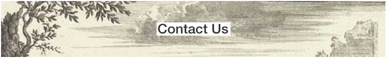

\

### For inquiries or to suggest a topic for one of our episodes, email us at lifelessonssciencestories@gmail.com or [click here](mailto:<lifelessonssciencestories@gmail.com>).

\
\
\

<h1 align="center" id="heading">Social Media</h1>

\
\

\
\
\
\
\
\
\
\
\
\
\
\
\
\
\
\

<h1 align="center" id="heading">Want to Check Out the Hosts' Social Media?</h1>

\
\

<h3 align="center" id="heading">Julie Cuartas</h3>

<h3 align="center" id="heading">Laura Hunter</h3>

