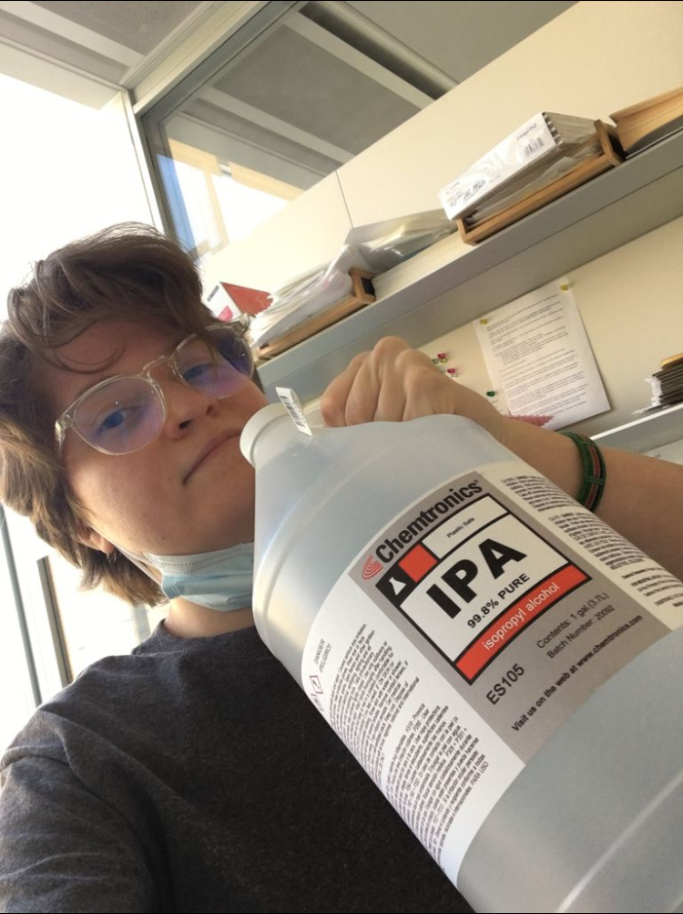

\

\
\
\
\

<h1 align="center" id="heading">The Podcast</h1>
Some stuff describing the inspiration for the podcast goes here, I guess...

\
\
\
\

<h1 align="center" id="heading">Meet the Hosts</h1>

<h3 align="center" id="heading">Julie Cuartas</h3>

Julie Cuartas, M.S. is currently working in a molecular neuroscience lab studying neurodegeneration. She is the proud matriarch of her very own mouse colony, and loves discussing science, preferably outdoors and with plenty of coffee.

<h3 align="center" id="heading">Laura Hunter</h3>

Laura Hunter is currently pursuing a PhD in a human evolution lab studying limb variation and evolvability. She plays way too much Dungeons & Dragons in her free time, and is always down to kick back an IPA and exchange cool animal facts.

\
\
\
\
\
\
\
\
\
\
\
\
\
\
\
\
\
\
\
\
\
\
\
\
\
\
\
\
\
\
\
\
\
\
\
\
\
\
\

<h1 align="center" id="heading">Listen to the Pod</h1>

/

\
\
\
\
\
\
\
\
\
\
\

